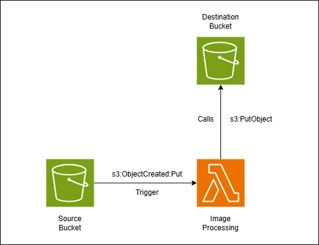

# Image Compressor Pipeline

A terraform configuration for an Image Compressor Pipeline involving a source bucket, processing lambda and destination bucket. The lambda function compresses `.jpg` images from source bucket and uploads compressed `.webp` image to destination bucket.

## Usage

- Clone the repo: `git clone https://github.com/soham-jobanputra-prominentpixel/terraform-practice-jpeg-compression .`
- Setup the AWS credentials for "Admin" profile and "TerraformBackend" profile: `aws configure --profile="Admin"` and `aws configure --profile="TerraformBackend"`
- Initialize terraform: `terraform init`
- Plan and apply: `terraform apply`

<!-- BEGIN_TF_DOCS -->
## Requirements

| Name | Version |
|------|---------|
|  [terraform](#requirement\_terraform) | ~> 1.14.7 |
|  [aws](#requirement\_aws) | ~> 6.39.0 |

## Providers

| Name | Version |
|------|---------|
|  [aws](#provider\_aws) | 6.39.0 |

## Modules

| Name | Source | Version |
|------|--------|---------|
|  [lambda](#module\_lambda) | terraform-aws-modules/lambda/aws | ~> 8.7.0 |
|  [bucket](#module\_bucket) | terraform-aws-modules/s3-bucket/aws | ~> 5.12.0 |
|  [event\_notification](#module\_event\_notification) | terraform-aws-modules/s3-bucket/aws//modules/notification | ~> 5.12.0 |

## Resources

| Name | Type |
|------|------|
| [aws_caller_identity.current](https://registry.terraform.io/providers/hashicorp/aws/latest/docs/data-sources/caller_identity) | data source |
| [aws_iam_policy_document.lambda](https://registry.terraform.io/providers/hashicorp/aws/latest/docs/data-sources/iam_policy_document) | data source |
| [aws_region.current](https://registry.terraform.io/providers/hashicorp/aws/latest/docs/data-sources/region) | data source |

## Inputs

| Name | Description | Type | Default | Required |
|------|-------------|------|---------|:--------:|
|  [source\_bucket\_name](#input\_source\_bucket\_name) | Source bucket name will be formatted according to account regional namespace name. e.g.: 'amzn-s3-demo-bucket' -> 'amzn-s3-demo-bucket-111122223333-us-west-2-an' | `string` | n/a | yes |
|  [destination\_bucket\_name](#input\_destination\_bucket\_name) | Destination bucket name will be formatted according to account regional namespace name. e.g.: 'amzn-s3-demo-bucket' is converted to 'amzn-s3-demo-bucket-111122223333-us-west-2-an' | `string` | n/a | yes |
|  [lambda\_function\_name](#input\_lambda\_function\_name) | Name for the image processing lambda function | `string` | n/a | yes |
|  [region](#input\_region) | AWS region to create resources at | `string` | n/a | yes |

## Outputs

| Name | Description |
|------|-------------|
|  [tail\_lambda\_function](#output\_tail\_lambda\_function) | Use this command to see lambda function logs |
|  [list\_source\_bucket](#output\_list\_source\_bucket) | Use this command to list objects in source bucket |
|  [list\_destination\_bucket](#output\_list\_destination\_bucket) | Use this command to list objects in destination bucket |
<!-- END_TF_DOCS -->
